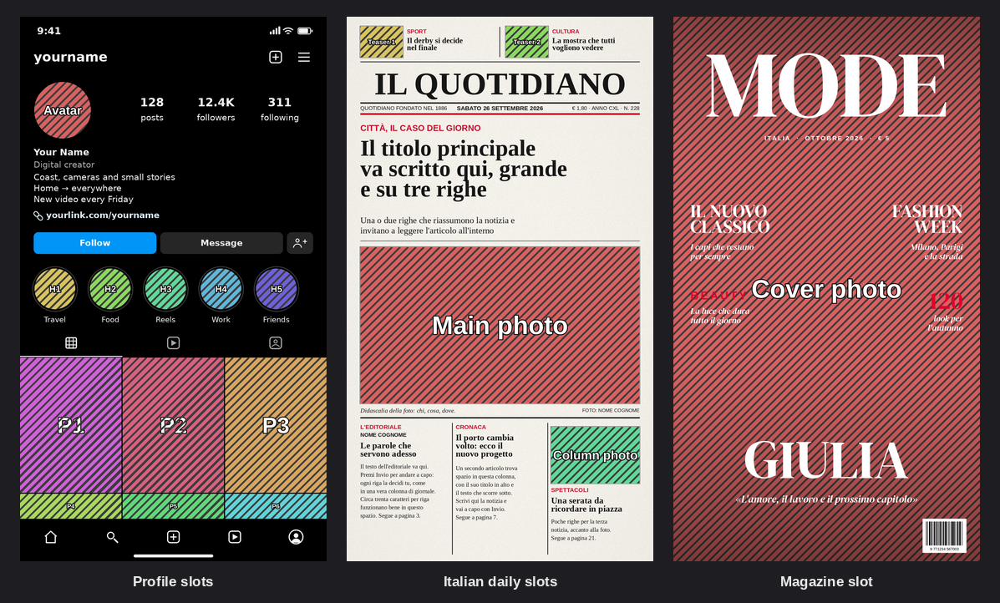

# FakeUI — editable mock-up pages for DaVinci Resolve

Edit-page **Effects** (Fusion macros) that turn your clips into a fake app screen, an Italian daily's
front page or a fashion-magazine cover. The layout, icons, rules and paper stay fixed; **every text and
every picture is yours to change** from the Inspector.


| Effect | What it does |
|---|---|
| `FakeUI_Profile` | Social profile page (generic app look, no real brand logos). Dark / Light theme, blue or grey buttons. 19 editable texts: clock, username, counts + labels, name, category, bio, link, button labels, 5 highlight names. |
| `FakeUI_Profile_Photo` | Puts a clip into a profile slot: Avatar, Highlight 1–5, Post 1–6. |
| `FakeUI_News` | Italian daily front page (quotidiano style): two teasers with photos on top, masthead, folio line with date and price, red kicker (occhiello), three-line headline, summary (sommario), big photo with caption and credit, and three columns below (editorial, story, photo story). Paper: Newsprint / White / Vintage. 23 editable texts + masthead font, style and size, headline size. |
| `FakeUI_News_Photo` | Puts a clip into a newspaper slot: Main photo, Teaser 1, Teaser 2, Column photo, Logo. |
| `FakeUI_Magazine` | Fashion-magazine cover: full-bleed photo, huge Didone masthead, issue line, cover lines left and right, big cover name and quote, barcode. Colour pickers for masthead + name, cover lines and accent; dark shade slider for readability; barcode on/off. 12 editable texts + masthead font, style and size, cover-name size. |
| `FakeUI_Magazine_Photo` | Puts a clip in as the cover photo. |

Defaults are placeholders (*IL QUOTIDIANO*, *MODE*): type your own masthead. No real newspaper or magazine
logos are included.

## How to build a page
Slot map (turn on **Show slot numbers** on the page effect to see it in the viewer):



1. **Top track**: any clip (a Solid Color generator works) with `FakeUI_Profile`, `FakeUI_News` or
   `FakeUI_Magazine`. It ignores its own picture. The output is the page, with transparent holes where
   the photos go (the magazine is see-through except for its texts).
2. **Tracks below**: one clip per picture, each with the matching `…_Photo` effect. Pick the **Slot**,
   set **Source aspect** to match the clip (4K/HD camera = 16:9, phone vertical = 9:16, photo 3:4…),
   then **Zoom** / **Reframe X/Y** to frame it. Videos keep playing inside their slot.
3. Type your texts in the page effect. Press **Enter** inside a text box for a new line (bio, headlines,
   story text).

### Photo controls
- **Fit**: Auto (Fill for photos, Fit for the logo), Fill (crop to fill the hole), Fit (whole picture, no crop)
- **Source aspect**: must match the clip, otherwise the picture is stretched
- **Zoom**, **Reframe X / Y** (−1 … +1 = edge to edge)
- **Saturation**: 0 = black & white (nice with the Vintage paper)

### Newspaper logo instead of a text masthead
Clear the **Masthead** text, then put your logo clip (PNG with transparency is best) on a track **above**
the page with `FakeUI_News_Photo` → Slot **Logo**. It is fitted into the masthead band.

### Magazine: subject in front of the masthead
The classic cover look where the head overlaps the title: duplicate the cover clip onto a track **above**
the page, give it `FakeUI_Magazine_Photo` with the same settings, and add a **Magic Mask** on it in the
Color page (output alpha). The person is drawn over the masthead, the background stays behind it.

## Install
1. Drag `Giniroisenkou_FakeUI.drfx` onto the Resolve window and confirm, then restart Resolve.
   (Copying `.setting` files by hand into the Templates folder does **not** work.)
   The effects appear under *Effects ▸ FakeUI*, each with a thumbnail.
2. **Font for the magazine**: install `fonts/DMSerifDisplay-Regular.ttf` and `-Italic.ttf`
   (double-click ▸ Install), then restart Resolve. It is a free font under the SIL Open Font
   License (`fonts/OFL.txt`). Any other font can be picked in the Inspector.

## Notes
- Design canvas **1080×1920 (9:16)**. On a 9:16 timeline it fits 1:1; on 2160×3840 it is scaled up.
- Fonts: profile *Segoe UI*, newspaper *Times New Roman* / *Georgia* / *Arial*: all standard on Windows.
- Texts that are longer than the default may need a smaller size or an extra line break.

## How it works
- **Page**: art PNGs (`FakeUI_<Template>_<variant>.png`, holes transparent) are loaded with `Loader`
  (`Setting:` relative paths) and switched with `Dissolve` tools. Each text is a `Text+` node merged on top,
  and its colour follows the theme / paper / colour pickers through expressions on `FUICtrl`.
- **Text+ calibration** (measured in Resolve 21.1): Fusion scales a font by its line height
  (hhea ascent + descent), so the generator sets `Size = px / 1080 × lineHeight(font) / 0.81` and line
  spacing relative to that line height. Line alignment inside a block follows the H anchor. `HorizontallyJustified`
  stretches lines and must stay 0.
- **Photo**: `MediaIn → FUICtrl (BrightnessContrast; all maths as hidden expression controls) → FUIResize
  (BetterResize to cover/fit size) → FUICrop (exact slot size + reframe) → FUIMerge` over a transparent
  1080×1920 `Background`. The macro builds its own canvas because a clip-level Fusion comp runs at the
  *source* resolution (e.g. 3840×2160).

## Build
```
python src/Giniroisenkou_FakeUI_build.py
```
Art, macros, thumbnails, `docs/` previews and `Giniroisenkou_FakeUI.drfx` in one go (Python 3 with Pillow
and NumPy; previews use the Windows fonts when found). All positions, texts, slots and colours live in
`src/Giniroisenkou_FakeUI_layouts.py`: moving a field or adding a slot is a one-line change there.

Tested on DaVinci Resolve Studio 21.1 (Windows). MIT licensed; DM Serif Display © its authors, SIL OFL 1.1.
