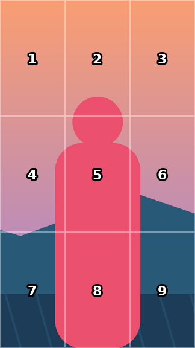
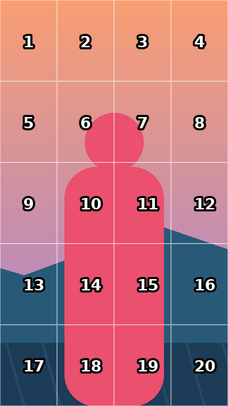

# Grid

Divide a clip into a grid of cells and choose which cells are visible. The video stays exactly where it
is; hidden cells (and gaps) are **transparent**, so the clip on the track below shows through. A second
mode fits the whole video inside a single cell.


*Checker pattern = transparent (the track below shows there).*

## Install
Drag `Giniroisenkou_Grid.drfx` onto the Resolve window, confirm, then restart Resolve.
Effects appear on the Edit page under **Effects ▸ Grid**.

## Use

### Show some cells of a video (main use)
1. Put the clip you want to cut into cells on **V2**, and whatever should show in the hidden cells on **V1**.
2. Frame the V2 clip as usual with its Inspector (Zoom / Position). Grid keeps that framing.
3. Drop **Grid** on the V2 clip. Set **Columns** and **Rows** (1–32 each).
4. Pick what shows with **Show**:

| Show | What you see |
|---|---|
| All cells | every cell (use with Gap to get tiles) |
| One cell (Cell) | only the cell number in **Cell** |
| Picked cells | the ticked boxes in **Picked cells** (cells 1–81, e.g. a 9×9 grid) |
| Cells 1 to N | cells 1…N in reading order. **Keyframe N** (0 → 9 on a 3×3) to reveal the video box by box |

**Guide (setup only)** draws white cell borders and shows hidden cells at 30% so you can see what you're
toggling. It changes the picture, so turn it **Off** to see the real result.

### Black (or white) hidden cells and lines
- **Hidden Cells**: *Transparent* (the track below shows) or *Filled with Colour*.
- **Gaps**: *Transparent* or *Filled with Colour*. Lines between cells need **Gap** above 0 (e.g. 4–8).
- **Colour** sets the fill: 0 = black, 1 = white. **Colour Opacity** 1 = solid.

Preset `Grid_Hidden_Black` = checkerboard, black hidden cells, thin black lines.

Nothing showing under a transparent cell? The clip on the track below must cover the whole frame. A 16:9
clip on a 9:16 timeline is letterboxed, so zoom it in its Inspector (about 3.16) to fill the frame.

Cells are numbered left → right, top → bottom:

 

### Fit a whole video into one cell
Set **Mode = Single Cell** and choose the **Cell**. Stack one clip per track to fill several cells.
For a clean 16:9 picture inside the cell, set the clip's **Inspector ▸ Retime and Scaling ▸ Scaling = Stretch**
and **Source Aspect = 16:9** (the effect undoes the stretch inside the cell).

## Controls
| Section | Controls |
|---|---|
| Grid | Mode (Cells / Single Cell), Columns, Rows |
| Show | Show (All / One / Picked / 1 to N), Cell, Cells 1 to N, Guide, Picked cells (81 tick boxes) |
| Look (px at 1080, scale with the frame) | Gap, Outer Margin, Corner Radius, Gaps (Transparent / Filled), Hidden Cells (Transparent / Filled), Colour (black → white), Colour Opacity |
| Framing | Source Aspect (Auto = keep the timeline framing), Fit, Zoom, Reframe X/Y, Nudge X/Y |
| Output frame | Frame preset (9:16, 4:5, 1:1, 16:9, 4K…) or Custom — match the timeline |

One-click presets: `Grid` · `Grid_One_Cell` · `Grid_Picked_Checker` · `Grid_Reveal_Box_By_Box` ·
`Grid_Hidden_Black` · `Grid_Tiles_Gaps` · `Grid_Tiles_White_Gaps` · `Grid_Single_Cell_Fit`, each with a thumbnail.

## How it works
`input → GRCtrl (all maths as expressions) → GRResize (clean downscale) → GRCore (CustomTool)`.

- On the Edit page the effect receives the clip already placed in the timeline frame (after the clip's
  Inspector Zoom / Position), so the grid always sits on the timeline frame.
- The CustomTool's output is the same size as its input. Resolve 21.1 crashed when a per-clip effect
  returned a different size.
- Things found by probing a CustomTool inside Resolve 21.1 (the generator follows them):
  - Every `NumberIn` is clamped to ±1,000,000, even when an expression sets it.
  - `pow()` returns 0 (use `^`).
  - An intermediate can use the ones before it.
  - Point inputs are not clamped.
- So the 81 tick boxes travel as five 18-bit numbers, one in `NumberIn7` and four in `PointIn3`/`PointIn4`,
  and each pixel reads its own cell's bit.

## Build
```
python src/Giniroisenkou_Grid_gen.py      # writes build/Edit/Effects/Grid/*.setting
python src/Giniroisenkou_Grid_render.py   # runs the same expressions with numpy: self-checks, thumbnails, docs
python src/Giniroisenkou_Grid_package.py  # -> Giniroisenkou_Grid.drfx
```
Needs Python 3 with numpy and Pillow. The validator also fails the build if any packed number would go over
Resolve's ±1,000,000 limit, or if an expression uses `pow()`.

## Repository layout
```
Giniroisenkou_Grid.drfx               the file to install (drag onto Resolve)
src/Giniroisenkou_Grid_gen.py         macro generator (controls, expressions, node graph, presets)
src/Giniroisenkou_Grid_render.py      offline validator + thumbnails + docs images
src/Giniroisenkou_Grid_package.py     packs the .drfx
docs/                                preview images (synthetic test picture, no personal footage)
DESCRIPTION.txt                      short summary
```

## Tested
Resolve Studio 21.1, 9:16 timeline, 4K 16:9 clip on V2 over another clip on V1. These all rendered
correctly, and selecting the clip no longer crashes Resolve:
- Hidden Cells filled black, and switched to transparent
- Black gap lines
- Picked cells (checkerboard)
- One cell
- Cells 1 to N
- Inspector Zoom under a fixed grid

## Version
**2026-09-28** — new **Gaps** and **Hidden Cells** switches (Transparent / Filled with Colour) replace the old Gap Colour and Gap Opacity pair, which could not make hidden cells black. Filled gaps stay solid against visible cells. Guide renamed "Guide (setup only)". New preset `Grid_Hidden_Black`.

**2026-09-27** — main purpose is now a cell selector:
- The video stays in place, and you show all cells, one cell, picked cells or cells 1…N.
- Hidden cells are transparent.
- Guide mode for setting up.
- Source Aspect Auto. Scaling = Stretch is no longer needed.
- Seamless cells at Gap 0.
- Removed Holdout / Subject Pop; for Magic Mask, use a copy of the clip on a track above.
- Fixed values being clamped by Resolve.

**2026-09-26** — fixed the crash when Grid was dropped on a clip (the output now always matches the input size).

## License
MIT
