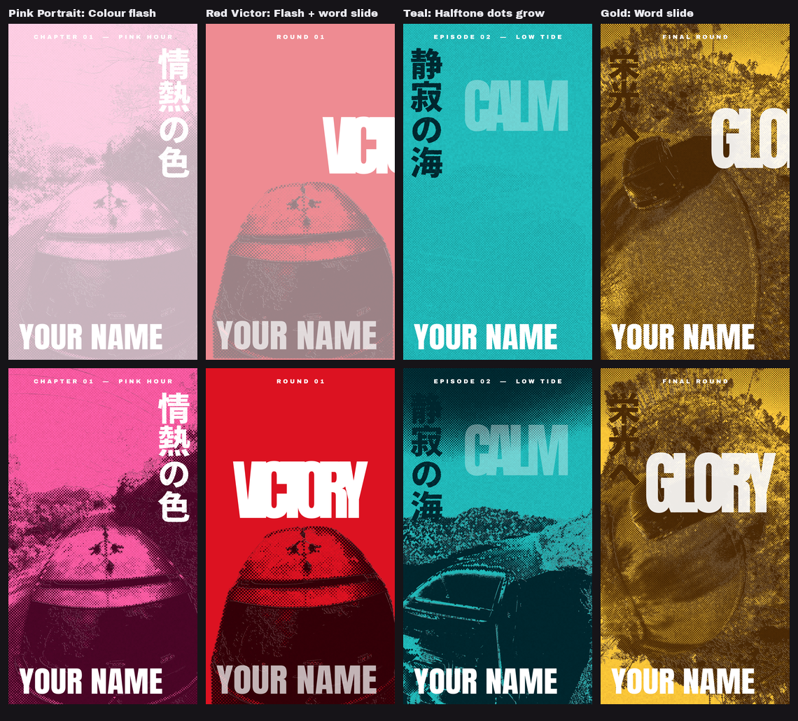

# MangaPanels

Turns your own footage or stills into the **coloured manga panel** look of anime character-intro cards:
the picture reduced to ink + paper, recoloured as a one-colour duotone, printed with a halftone dot screen,
with a huge word **behind** the subject, a distressed vertical Japanese line and name captions on top.


| Effect | Look | In / Out |
|---|---|---|
| `MangaPanels_PinkPortrait` | Hot pink, dots on the paper tones, white vertical text right, top line + name | Colour flash in |
| `MangaPanels_RedVictor` | Crimson, **flat red field + huge white word behind the subject**, bottom-left name | Flash + word slide in, word slide out |
| `MangaPanels_Teal` | Teal, screentone on the mid-tones only, ghosted word, vertical text left | Halftone dots grow in / shrink out |
| `MangaPanels_Gold` | Gold, whole frame as a pure halftone print, big word, vertical text left | Word slide in / out, slow push-in |

All four are the same effect with different starting values, so every control is in every preset.
Default texts are placeholders; type your own. No characters, logos or show names are included.

## Effect, not a Title / Generator

It's an **Effect** (drop it on a clip), because it has to *read* your clip: the two-tone split, the
halftone and the subject mask all come from the clip's pixels, and a Title/Generator gets no picture
to work with. It still layers like a title:

- **TitleCards over MangaPanels**: add a TitleCards effect **after** MangaPanels on the same clip
  (Inspector ▸ Effects, the lower one is applied last), or put TitleCards on a clip / Adjustment Clip
  on a track above.
- **MangaPanels over something else**: set *Behind The Subject* = **Transparent**. Only the subject
  and the texts are drawn; the track below (a TitleCards card, other footage) shows through.

## Install

1. Drag `Giniroisenkou_MangaPanels.drfx` onto the Resolve window, confirm, restart Resolve.
   The effects appear under **Effects ▸ MangaPanels**, each with a preview icon.
   (Copying the `.setting` files by hand does **not** work.)
2. **Fonts**: install the three fonts in `fonts/` (double-click ▸ *Install*), then restart Resolve:
   **Anton** (big word, name), **Archivo Black** (top line), **Noto Sans JP Black** (vertical Japanese).
   All are free under the SIL Open Font License (`fonts/OFL-*.txt`). Any other font can be picked
   in the Inspector.

## Controls (Inspector ▸ Effects)

**Look**: *Colour* (Hot Pink, Magenta, Crimson Red, Teal, Gold or Custom with two colour pickers for
paper and ink), *Swap Ink / Paper*, *Exposure*, *Contrast*, *Shadow Amount* (how much becomes solid ink),
*Shadow Edge Softness*, *Line Weight* (outline thickness), *Line Amount*, *Line Threshold*.

**Halftone**: *Dots Sit On* (paper / ink / mid-tones only / whole frame / off), *Dot Size*, *Dot Scale*,
*Screen Angle*, *Dot Density*, *Mid-tone Low / High*, *Screen Texture* (faint dots over the whole frame).

**Print**: *Paper Grain*, *Grain Size*, *Animated Grain*, *Misregistration* (1–3 px colour plate offset)
and its angle, *Panel Border*.

**Frame**: *Canvas* (9:16 1080×1920 by default, 4:5, 1:1, 16:9, 9:16 4K, or Same as clip),
*Fit* (fill / fit), *Zoom*, *Reframe X / Y*, *Push-In From / To* (1.00 → 1.06 over the clip).
4K or 16:9 footage fills the 9:16 panel automatically; the effect reads the clip size itself.

**Subject**: *Layer*, *Subject Mask*, key and oval settings, *Behind The Subject* (manga scene, flat
paper colour, screentone field, transparent). See the next section.

**Big word / Vertical text / Captions**: text, font, style, size (px at 1080), colour (white, paper, ink,
black), position, opacity, letter spacing, rotation. The vertical text has *Roughness*, *Rough Grain* and
*Edge Jitter* for the distressed ink edge, and can sit behind or in front of the subject. *Captions Over
Subject* sets how see-through the top line and name are where they cross the subject.

**Animation**: *In* (hard cut, colour flash, halftone dots grow, word slide, flash + word slide),
*Out* (hard cut, colour flash, halftone dots shrink, word slide out), lengths in frames, flash colour,
slide direction. The In plays at the clip start and the Out at the clip end, so trim the clip to time it.



## Putting the subject in front of the big word

The "depth sandwich" (field → big word → subject → captions) needs a mask of the subject.

### With Resolve Studio: Magic Mask (best for video)

Magic Mask is a **Studio-only** feature. Use two copies of the clip:

1. **V1**: the clip with a MangaPanels effect, *Layer* = **Back plate**. It draws the field, the big word,
   the vertical text and the captions.
2. **V2**: a copy of the same clip directly above, same effect with the **same settings**, but
   *Layer* = **Front subject**.
3. On the V2 copy, in the **Color** page, add **Magic Mask** (Person or Object), track it, and turn on
   the node's **alpha output** (right-click the node graph ▸ *Add Alpha Output*, connect the mask). Only
   the subject of V2 is kept, so it sits over the word on V1.
   Tip: track the mask *before* you add the effect to V2 (or while it's disabled), so Magic Mask
   analyses the normal picture rather than the two-tone one.
4. The captions are drawn on both layers: fully on V1, and at *Captions Over Subject* opacity on V2, so
   the name reads as semi-transparent where it crosses the person.

### Without Studio (or for stills)

Set *Layer* = **Full panel** (one clip) and pick a *Subject Mask*:

| Subject Mask | Use it for |
|---|---|
| Clip alpha | A **cut-out PNG** (subject with a transparent background), or a clip whose own alpha is the subject. Transparent areas become paper, so the subject stands on the field (this is how the Red Victor preview was made). |
| Luma key: bright / dark subject | A subject clearly brighter / darker than the background (sky, studio wall). *Key Threshold* and *Key Softness* set the edge. |
| Green screen | Footage shot on green. |
| Oval holdout | Anything: a soft oval you place over the subject (*Oval Centre*, *Width*, *Height*, *Softness*). Rough, but works in the free version. |

## Tested

On DaVinci Resolve Studio 21.1 (Windows), with my own footage on a 1080×1920 timeline: all four presets
from 4K 16:9 clips and a cut-out still, every stage of the node graph checked, the In animations checked
on early frames, and the Oval holdout, Same-as-clip canvas and Transparent background checked. Not tested:
the Magic Mask two-track setup (Magic Mask can't be driven from a script, so set it up by hand as above)
and the free version of Resolve.

## How it works

One Fusion macro per preset (`build/Edit/Effects/MangaPanels/*.setting`, packed into the `.drfx`).
Every control and all hidden maths live on one pass-through `MPCtrl` node (ids start with `k`); the
rest reads it through expressions:

```
clip -> MPCtrl -> MPFit (merge onto a transparent W x H canvas: fill/fit, reframe, push-in)
     -> MPInk    CustomTool  r = ink (outlines from a local-contrast test + shadow threshold),
                             g = tone, b = subject mask, a = outlines only
     -> MPDots   CustomTool  halftone screen (rotated grid, dot radius from the tone at the cell
                             centre), halftone-grow transition, misregistration fringes
     -> MPColour CustomTool  duotone paper / ink + fringes + paper grain            = the look
     -> MPField  CustomTool  scene / flat / screentone / transparent behind the subject
     -> + word -> + vertical text (MPVertRough: noise-eroded, jittered alpha) -> + top line -> + name
look -> + word / captions at their "over subject" opacity -> MPSubj (alpha = subject mask)
back + front -> + vertical text if in front -> MPFinal (colour flash, panel border)
```

Worth knowing if you extend it:
- A clip-level Fusion comp runs at the **source** resolution, so the macro builds its own canvas. The
  source size comes from `self.Input.OriginalWidth` / `OriginalHeight` on MPCtrl, so there is no
  "source aspect" control. (`Input.OriginalWidth` without `self.` evaluates to 0.)
- Text+ vertical text: `Direction = 3` (Vertical), `Orientation = 1` (Upright). `Direction = 2` is
  *Reversed Horizontal*.
- To rotate/stretch a Text+ layer around a corner with a Transform, keep `Center` at 0.5, 0.5 and put the
  corner in `Pivot`; moving `Center` moves the whole layer off screen.
- CustomTool: at most 8 NumberIn / 4 PointIn / 4 Setup / 4 Intermediate; trig is in degrees.

## Build

```
python src/Giniroisenkou_MangaPanels_gen.py       # writes build/Edit/Effects/MangaPanels/*.setting
python src/Giniroisenkou_MangaPanels_thumbs.py    # icons + docs previews from renders/ (frames exported from Resolve)
python src/Giniroisenkou_MangaPanels_package.py   # -> Giniroisenkou_MangaPanels.drfx
```

Python 3 (+ Pillow for the thumbnails). To add a preset, add an entry to `PRESETS` in the generator
(only the values that differ from `BASE`) and to `PRESET_ORDER`.

## Files

```
Giniroisenkou_MangaPanels.drfx                  the file to install (4 effects + icons)
src/Giniroisenkou_MangaPanels_gen.py            macro generator: presets, controls, node graph
src/Giniroisenkou_MangaPanels_thumbs.py         Effects-panel icons + docs previews
src/Giniroisenkou_MangaPanels_package.py        packs the .drfx
docs/Giniroisenkou_MangaPanels_<Preset>.png     one preview per preset (rendered in Resolve)
docs/Giniroisenkou_MangaPanels_overview.png     all four presets
docs/Giniroisenkou_MangaPanels_animations.png   In animations
fonts/                                          Anton, Archivo Black, Noto Sans JP Black + OFL licences
DESCRIPTION.txt                                 short summary
```

## Version

**2026-09-27**: first build.

## Credits and licence

Fonts: Anton (Vernon Adams), Archivo Black (Omnibus-Type), Noto Sans JP (Google / Adobe), all SIL Open
Font License 1.1. Preview images: frames of the author's own footage. Code: MIT.
