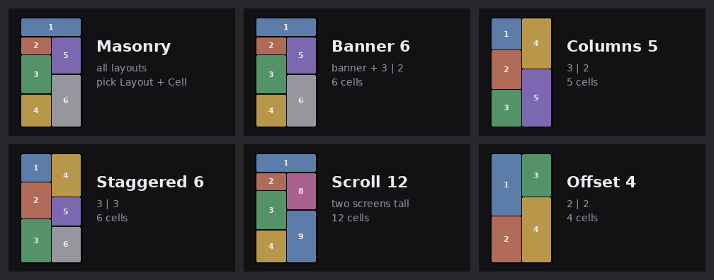
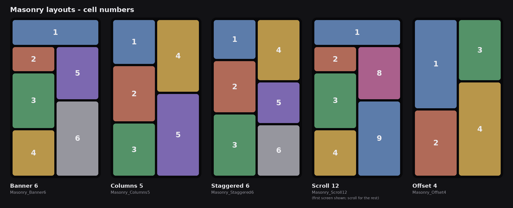

# Masonry

A DaVinci Resolve **Edit-page effect** (Fusion macro) for the Pinterest / Instagram
**masonry grid** look: several clips in one vertical frame, in boxes of different
heights with even gaps and rounded corners.


## Install

1. Download `Giniroisenkou_Masonry.drfx` from this folder.
2. **Drag it onto the Resolve window** and confirm, then restart Resolve.
   (Copying the `.setting` into the Templates folder by hand does **not** work: the
   effect shows up by name with no controls.)
3. Find it in **Effects → Masonry** on the Edit page.

You get the main effect plus one quick effect per layout, each with its own thumbnail:



## Use

1. Put each clip on **its own track**, stacked over the same stretch of timeline.
2. Drop **Masonry** (or a quick effect such as **Masonry_Banner6**) on **every** clip.
3. Give them all the **same Layout**, and each one a **different Cell**.
4. On each clip set **Source Aspect** to match the footage (4K / HD camera = 16:9, phone vertical = 9:16).

Set up one clip, then right-click → Copy, and Paste Attributes onto the others; then only change Cell.

## Layouts

Cells run down the left column first, then the right:



| Layout | Quick effect | Cells |
|---|---|---|
| Banner 6 — wide banner, then 3 \| 2 | `Masonry_Banner6` | 6 |
| Columns 5 — 3 \| 2 | `Masonry_Columns5` | 5 |
| Staggered 6 — 3 \| 3 | `Masonry_Staggered6` | 6 |
| Scroll 12 — two screens tall, for a scrolling feed | `Masonry_Scroll12` | 12 |
| Offset 4 — 2 \| 2 | `Masonry_Offset4` | 4 |

## Inspector

Four collapsible sections; every control has a hover tooltip.

| Section | Controls |
|---|---|
| 1 Start here | **Frame Preset** (9:16 Reels, 4:5, 1:1, 4K vertical, 16:9 HD / 4K, or Custom → Frame Width / Height), **Layout**, **Cell** |
| 2 Look — same on every clip | **Gap** and **Corner Radius**, in px at 1080 wide (they scale with the frame) |
| 3 Picture inside the box | **Source Aspect** (must match the clip), **Zoom**, **Reframe X / Y** (−1 … +1 = edge to edge) |
| 4 Scroll — same on every clip | **Scroll Offset** and **Scroll Speed** move the whole grid like a feed. Scroll 12 is two screens tall: an offset of 1920 shows the lower half |

Each clip fills its box (cover-fit: no bars, the overflow is cropped). Everything outside
the box is transparent, which is why the stacked tracks build the grid.

## How it works

```
MediaIn → MMCtrl → MMResize → MMPlace → MMMerge → MediaOut
          (maths)  (resize to  (crop/pad  ↑ over MMBG (transparent, frame size)
                    shown size) onto frame) ↑ masked by MMMask (rounded box)
```

- A clip-level Fusion comp runs at the **source** resolution (e.g. 3840 × 2160), not the
  timeline's, so the macro builds its own canvas at the Frame Preset size.
- The clip is resized **once**, straight to the size it is shown at in its box, then
  cropped/padded into place. No second rescale, so 4K footage stays sharp in big boxes.
- `MMCtrl` is a pass-through node holding every control; all the geometry is hidden
  expression controls on it.

## Build it yourself

```
python src/Giniroisenkou_Masonry_build.py
```

writes the macros, re-computes the macro maths in Python and checks every layout
(boxes inside the frame, even gaps, the clip always covers its box), draws the
thumbnails and docs, and packs `Giniroisenkou_Masonry.drfx`.
Needs Python 3 with Pillow. **To add a layout, add one entry to `LAYOUTS`** in
`src/Giniroisenkou_Masonry_gen.py`: a list of `(x, y, w, h)` boxes on a 1080 × 1920
grid, touching each other; gaps and corners are added at render time.

## Repository layout

```
Giniroisenkou_Masonry.drfx           the file to install (drag onto Resolve)
src/Giniroisenkou_Masonry_gen.py     the macro generator (layouts, controls, node graph)
src/Giniroisenkou_Masonry_build.py   build + self-check + thumbnails + package
docs/                               preview images
DESCRIPTION.txt                     short summary
```

## Things to know

- **Source Aspect must match the clip**, or the picture is stretched.
- Layouts are drawn for 9:16; on 4:5, 1:1 or 16:9 frames they stretch to fit.
- Positions snap to whole pixels, so a very slow Scroll Speed (under ~1 px/frame) moves in steps.
- Some phone and action-cam clips carry rotation metadata that Resolve applies *after*
  Fusion; if a clip looks sideways inside the box, fix its orientation first.

## Version

**2026-09-26** — one-click effect + thumbnail per layout; Frame Preset;
even gaps on every frame shape; clip resized once to its shown size (sharper 4K);
Inspector sections with tooltips; Source Aspect defaults to 16:9.

Built and tested on DaVinci Resolve Studio 21.1 (Windows).

## License

MIT
