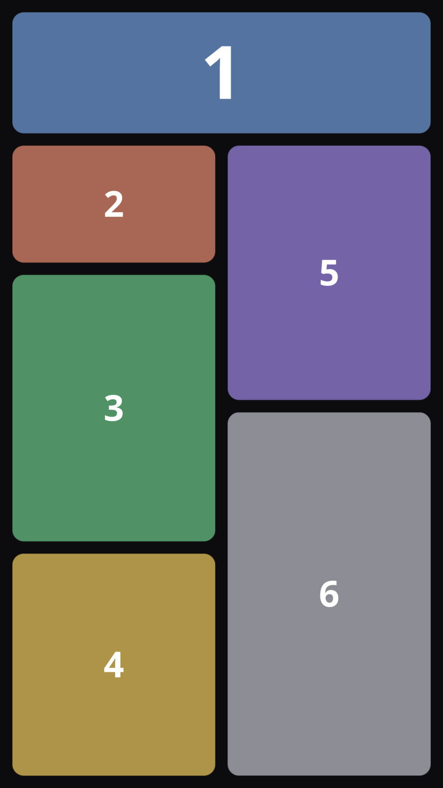
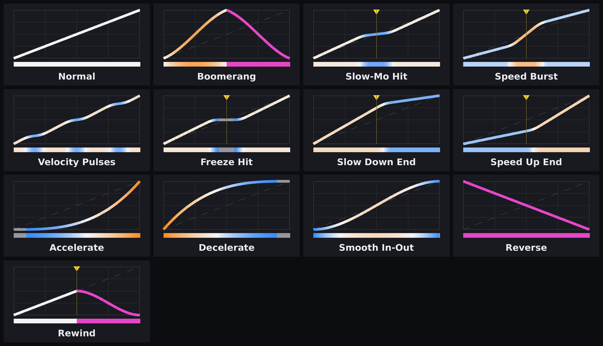
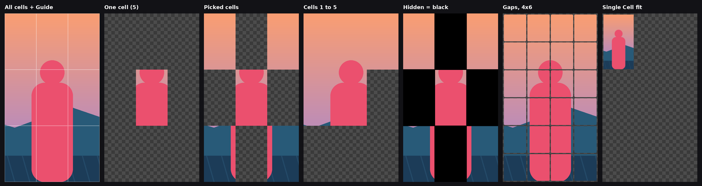
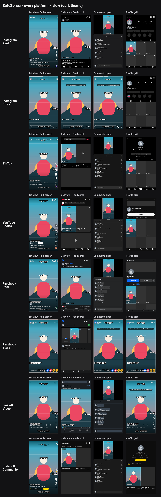
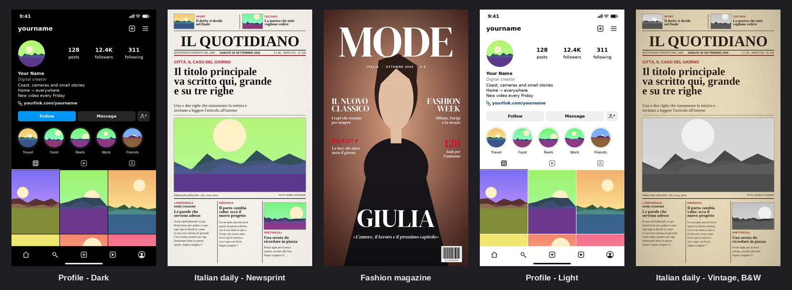
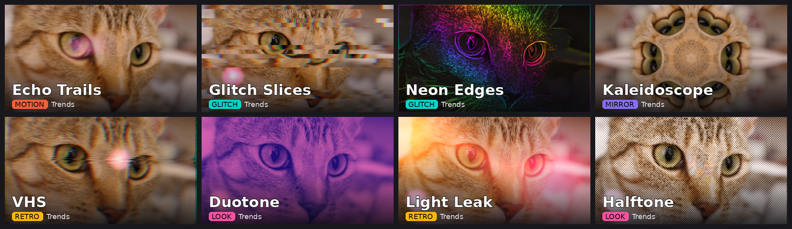
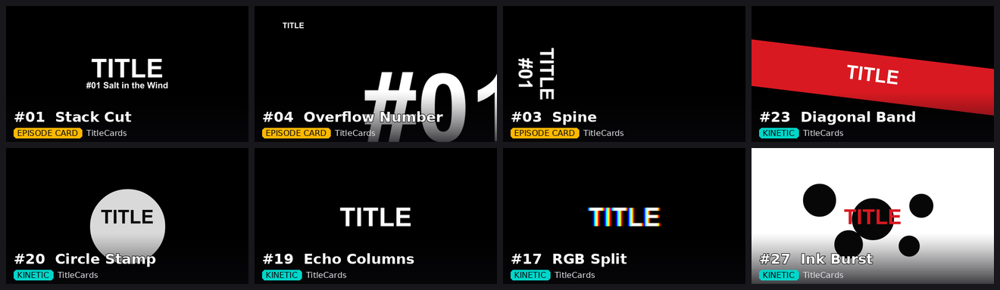
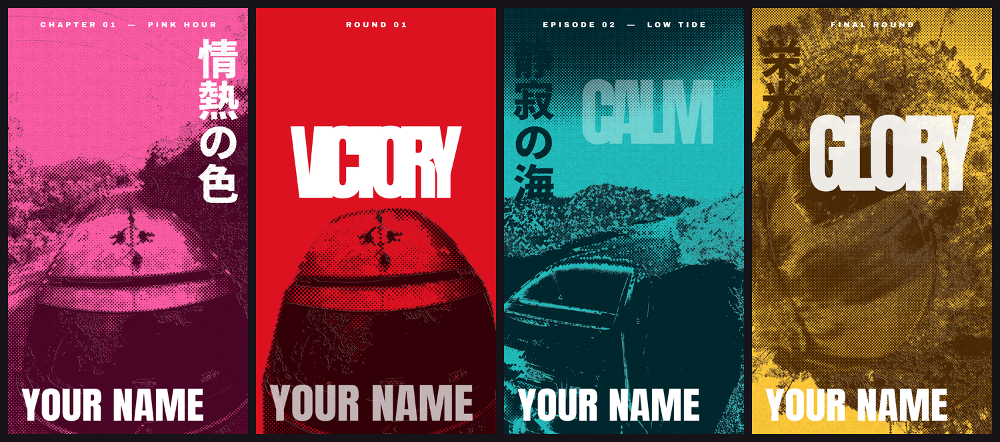
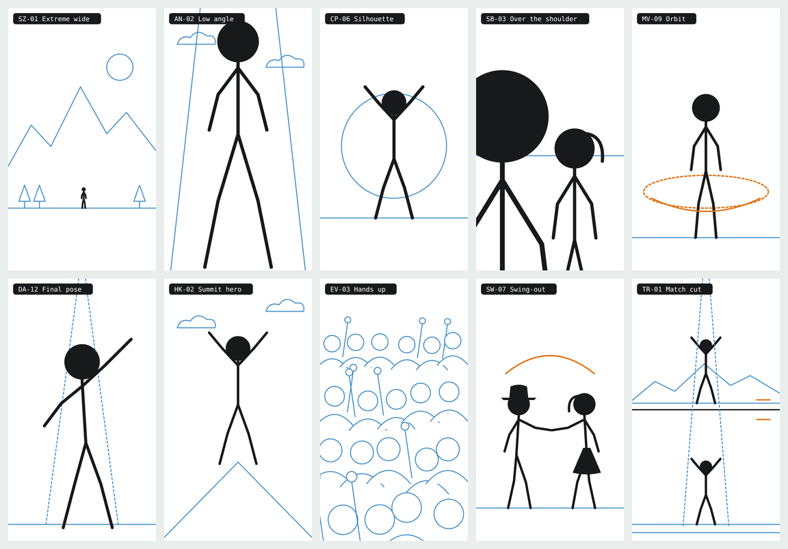
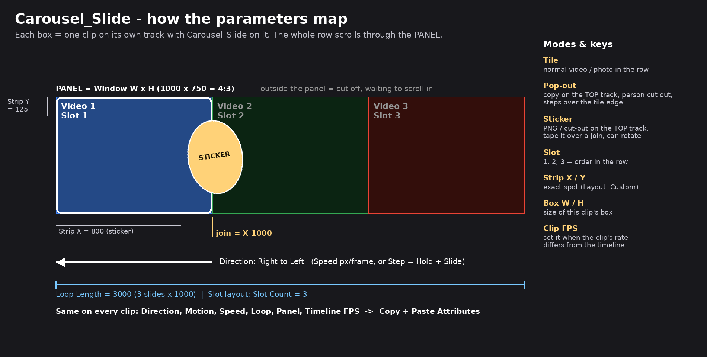

# DaVinci Resolve Studio Plugins Collection

Effects, templates and LUTs for DaVinci Resolve, made for vertical social video
(Reels, TikTok, Shorts, Stories). Each plugin lives in its own folder with its source,
the file to install, preview images and its own README. Every effect also has
a preview thumbnail inside Resolve's Effects panel.

## Installing

**Effects and templates (`.drfx`)**

1. Open the plugin's folder and download its `.drfx` file.
2. **Drag the `.drfx` onto the Resolve window** and confirm, then restart Resolve.
3. The effects appear in the Edit page under **Effects → *plugin name***.
   Drop one on a clip and set it up in **Inspector → Effects**.

Copying `.setting` files into Resolve's Templates folder by hand does **not** work:
the effect shows up by name, with no controls. (Effects-panel thumbnails are PNGs next to each
`.setting`; Resolve 21.1 shows them only when a PNG is smaller than about 48 KB.)

**LUTs (`.cube`)** — copy them into Resolve's LUT folder
(`C:\ProgramData\Blackmagic Design\DaVinci Resolve\Support\LUT\`) and choose
*Project Settings → Color Management → Update Lists*. Details in the plugin's README.

Every effect builds its own output canvas, so 4K or 16:9 footage works on a vertical
timeline; set the effect's **Source Aspect** / frame controls to match your footage and timeline.

## Plugins

### Masonry
Pinterest / Instagram style masonry grid: each clip on its own track fills one box of a
layout, with even gaps and rounded corners. 5 layouts, one-click effect per layout,
scrolling feed mode. → [Masonry/](Masonry/)



### Speed_Curves
Ready-made retime curves instead of hand-drawn Retime Curve keyframes: boomerang, slow-mo hit,
speed burst, velocity pulses, freeze hit, rewind and more (13 presets). Drop it on a clip, pick a
preset, move the Hit Point. One-click effect + icon per preset. → [Speed_Curves/](Speed_Curves/)



### Grid
Divides a clip into Columns × Rows cells and shows only the cells you pick: all, one, any ticked
cells (up to 9×9) or cells 1…N (keyframe N to reveal the video box by box). The video stays as
framed; hidden cells are transparent, so the track below shows through. Can also fit a whole video
into a single cell. → [Grid/](Grid/)



### SafeZones
Turns the monitor into a phone screen and draws each app's real interface on it: Instagram Reel / Story,
TikTok, YouTube Shorts, Facebook Reel / Story, LinkedIn Video and Insta360 Community, in full-screen, feed,
comments and profile-grid views. Your edit is cut to the upload shape (9:16, 4:5, 1:1, 3:4, 16:9, never
squeezed) and placed the way the app shows it, on vertical or horizontal timelines, so you see what gets
covered before you post. One-click effect + icon per app. → [SafeZones/](SafeZones/)



### FakeUI
Editable mock-up pages for vertical video: a social profile page, an Italian daily front page
(quotidiano style: teasers, masthead, red kicker, headline, big photo, three columns) and a
fashion-magazine cover (Didone masthead, cover lines, cover name). Layout stays fixed; every text and
picture is yours to change, one clip per photo slot. → [FakeUI/](FakeUI/)



### Trends
28 drop-on-a-clip effects for trending Reels / TikTok looks: Echo Trails, Stutter, Shake Punch, Zoom Blur,
Ken Burns, Blur Reveal, Flicker, RGB Split, Glitch Slices, Neon Edges, VHS, Film Grain, Pixelate, Light Leak,
Filter 2016, Dreamy Glow, Teal & Orange, Duotone, Comic, Halftone, Vignette, Cinema Bars, Mirror Tiles,
Kaleidoscope, Symmetry, Wave, Fisheye and Number Counter. Each has its own thumbnail and a tooltip on every
control; several can pulse on the beat. → [Trends/](Trends/)



### TitleCards
28 drop-on-a-clip title-card generators styled after anime episode cards and kinetic-type
loading-screen title reveals: a word, a number/tag (the tag can be any word, not just a number),
sometimes a subtitle or quote line, animated on and back off. Episode Card family (Stack Cut,
Ghost Settle, Spine, Overflow Number, Whisper, Edge Crop, Number Block, Ember Title, Smoke Stack,
Warm Stack, Heat Fade, Lavender Lockup, Spaced Stack, Logo Plate) and Kinetic family (Letter Focus,
Letter Cycle, RGB Split, Slice Reveal, Echo Columns, Circle Stamp, Frame Fill, Box Lockup,
Diagonal Band, Name Echo, Outline Giant, Ribbon Loop, Ink Burst, Red Slash). No copyrighted names,
logos or artwork — generic placeholder text and original Fusion node graphs only. Each has its own
thumbnail; the title stays until the clip ends, so trim the clip to set how long it's on screen.
→ [TitleCards/](TitleCards/)



### Title_Sliding
A title that slides side to side over a black band, with a thin line separating title and subtitle
(the anime opening-credit look), plus news lower thirds from the same parts: LIVE / BREAKING tag box,
accent bar and scrolling ticker. Four one-click looks (anime strip, News, Breaking, Cinema); text,
fonts, colours, band opacity, line colour / position, direction, exit, easing, timings and a slow text
drift are all adjustable. Animates in at the clip start and out at its end: trim the clip to set how
long it stays. → [Title_Sliding/](Title_Sliding/)

### MangaPanels
The coloured manga-panel look of anime character-intro cards, from your own footage or stills: ink + paper
two tones, one-colour duotone (hot pink, magenta, crimson, teal, gold or custom pickers), halftone dot
screen, paper grain and misregistration, a huge word **behind** the subject, a distressed vertical Japanese
line and top / bottom-left name captions. In / out: colour flash, halftone dots grow, word slide; slow
push-in. Four presets (Pink Portrait, Red Victor, Teal, Gold). The subject goes in front of the word with
Magic Mask (Studio) or, without Studio, a cut-out / luma key / green screen / oval holdout.
→ [MangaPanels/](MangaPanels/)



### Shootbook
Stick-figure storyboard kit for planning vertical videos: 140 named shot types as 1080 × 1920 PNGs
(shot sizes, angles, composition, camera moves, dance, hiking, events, swing dancing with a live band,
transitions). Black subject, blue background, orange movement; each frame carries its code and name.
Drop them into the Media Pool, sort by name and Shift+F12 to block out a timeline before you shoot,
then lay real clips over them. Includes a browsable shot-list page and a CSV. Not an effect: nothing
to install. → [Shootbook/](Shootbook/)



### Carousel_Slide
Collage-slideshow carousel (the Crsel app look): videos, photos and cut-out stickers scroll together
through a rounded panel, as equal slides or a mixed-size collage. A cut-out person can step over the
tile edge, and stickers can be taped over the join between two slides. Continuous drift or step
(hold + slide), 4 directions, endless loop, frame presets for Reels 9:16, Instagram 4:5 / 1:1, 4:3 and
16:9 / 4K. One effect per clip, each clip on its own track; mixed 24/30 fps clips stay in sync.
→ [Carousel_Slide/](Carousel_Slide/)



## Folder layout

```
<Plugin>/
  Giniroisenkou_<Plugin>.drfx   the file to install
  README.md                    what it does, how to use it, how it works
  DESCRIPTION.txt              short summary
  src/                         generator / build scripts
  docs/                        preview images
  fonts/                       bundled free fonts, when a plugin needs one (FakeUI, MangaPanels)
```

Tested on DaVinci Resolve Studio 21.1 (Windows). MIT licensed.
