# SafeZones

A DaVinci Resolve **Edit-page effect** (Fusion macro) that turns your monitor into a **phone screen**
and draws each app's real interface on it, so you see what covers or crops your video before you post.


## Install

1. Download `Giniroisenkou_SafeZones.drfx` from this folder.
2. **Drag it onto the Resolve window** and confirm, then restart Resolve.
   (Copying the `.setting` into the Templates folder by hand does **not** work: the effect shows up by name with no controls.)
3. Find it in **Effects → SafeZones** on the Edit page.

You get the main effect plus one quick effect per app, each with its own icon:

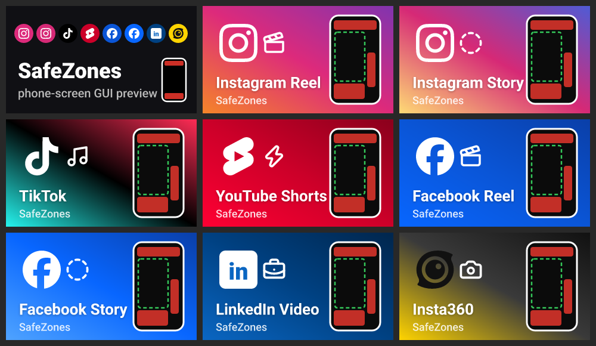

## Use

1. Put an **Adjustment Clip** on a track above your edit, over the part you want to check.
2. Drop **SafeZones** (or a quick effect such as **SafeZones_InstagramReel**) on the adjustment clip.
3. In **Inspector → Effects** set **Timeline** to your timeline format and **Upload shape** to the shape you will post.
4. **Turn it off (or delete the adjustment clip) before you render.**

## Platforms and views

8 apps: Instagram Reel, Instagram Story, TikTok, YouTube Shorts, Facebook Reel, Facebook Story,
LinkedIn Video, Insta360 Community.

| View | What you see |
|---|---|
| **1st view · Full-screen** | Your video on the phone with the app GUI on top, exactly where it sits: Story progress bars, name, reply bar, heart and send; Reel title, the like / comment / repost / share rail, name + Follow, caption, audio line. Anything under those is covered. |
| **3rd view · Feed scroll** | The phone shows the app **feed** (header, caption, first comment, nav bar) with your video in the post: full-width posts in the Instagram, Facebook and LinkedIn feeds (max 4:5), the search tile on TikTok, the Shorts shelf card on YouTube, the stories row on Facebook, the Explore card on Insta360. |
| **Comments open** | The comment sheet slides up and the video shrinks into the space above it. |
| **Profile grid** | Your video as the newest thumbnail: Instagram 3:4, TikTok 3:4, YouTube Shorts tab 9:16, Facebook Reels tab 9:16, Insta360 profile card, Instagram Story as a highlight circle. |

Where an app has no such screen (Stories have no feed or comments, LinkedIn has no profile video grid,
Facebook Stories don't live on the profile), the full-screen view is shown with a note.

| | | |
|---|---|---|
| 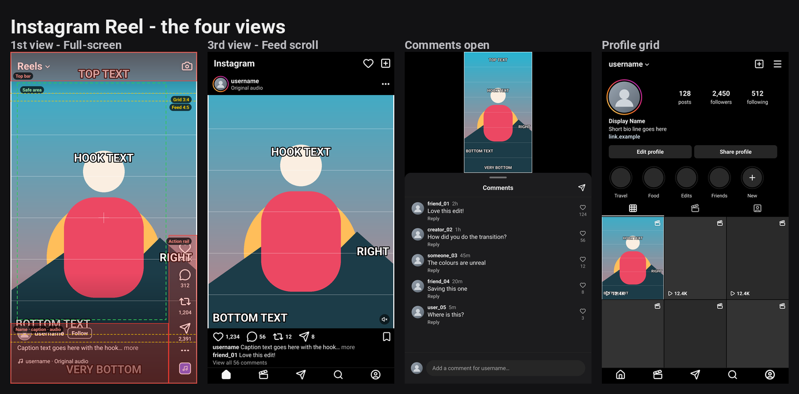 | 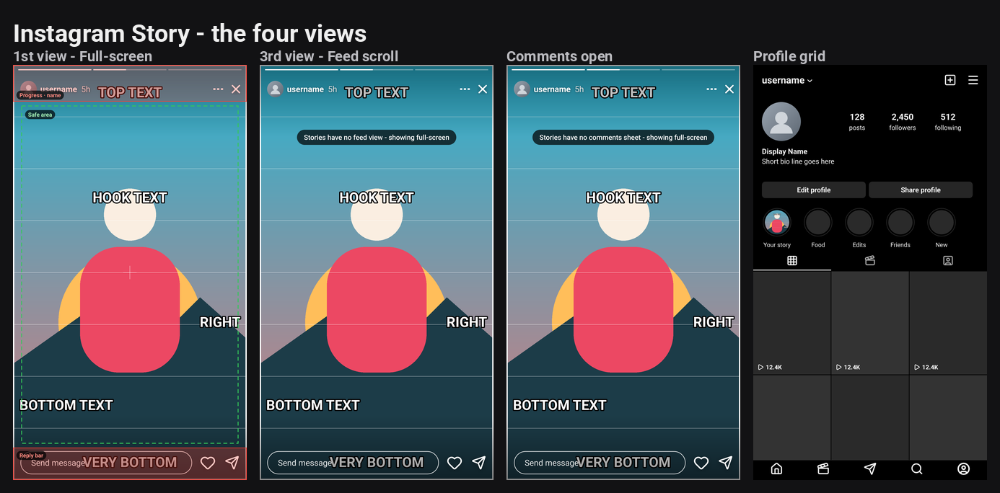 | 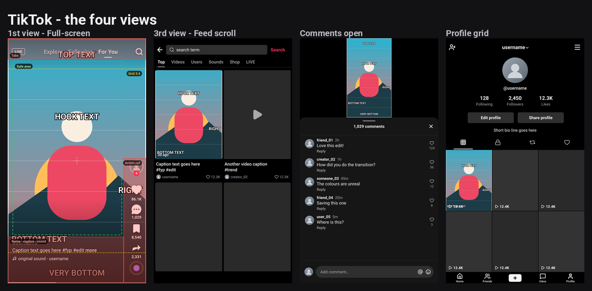 |
| 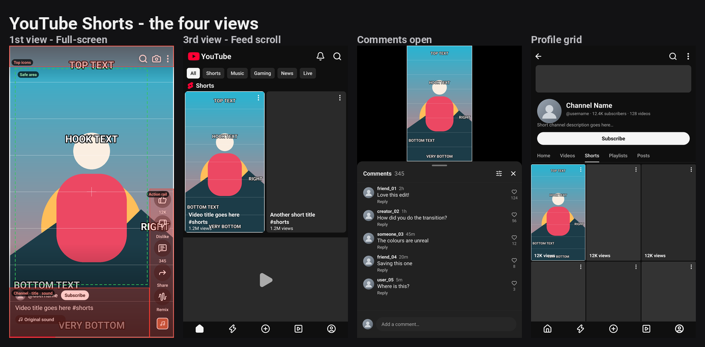 | 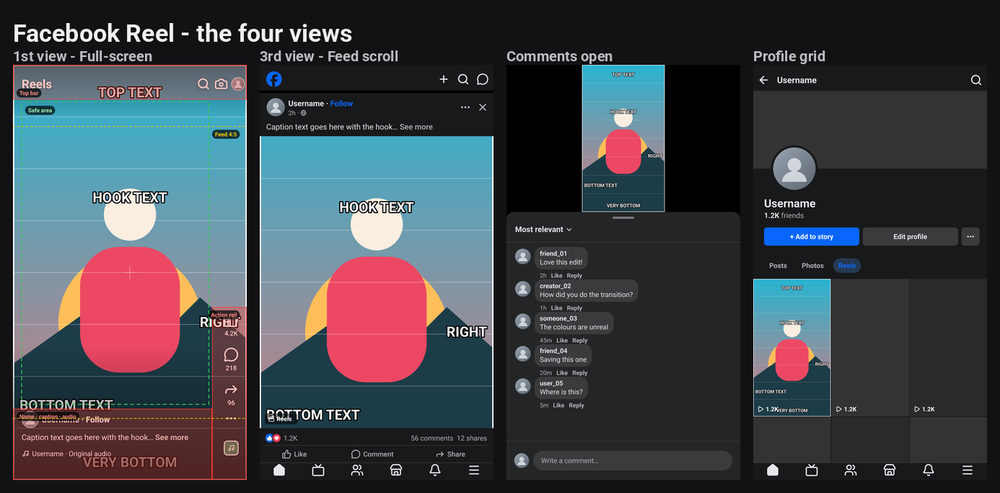 | 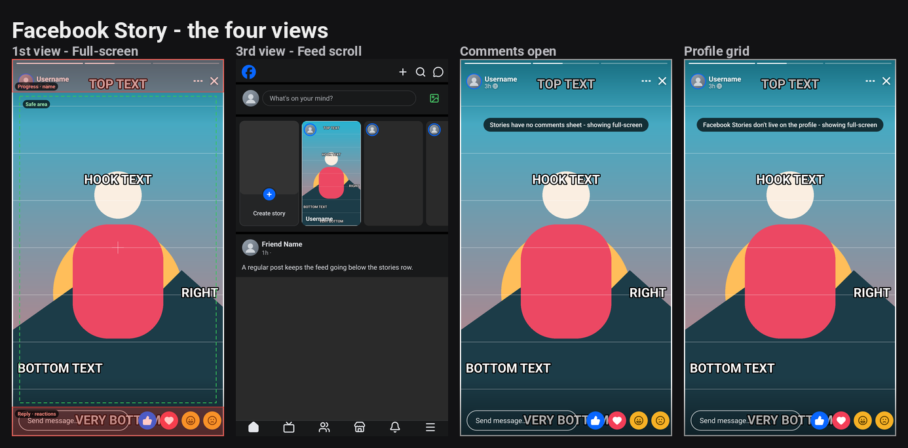 |
| 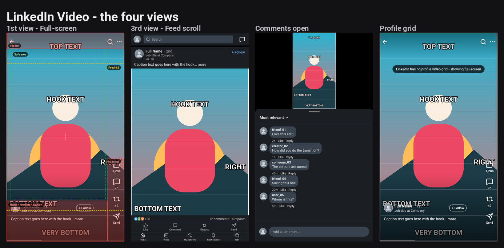 | 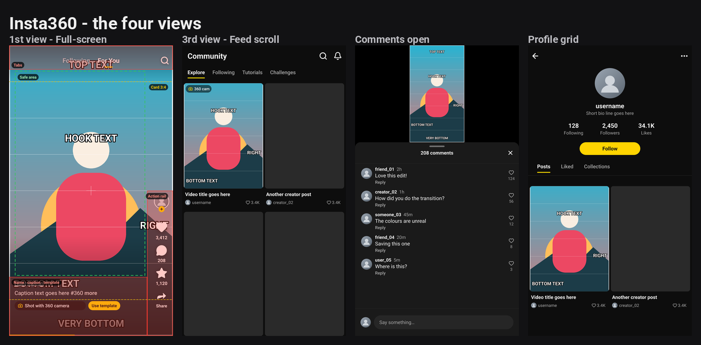 | |

## Timeline and upload shape

Edit vertical or horizontal as you like. **Upload shape** is the file you will post: everything outside that
shape is **cut away, never squeezed**, and the result is shown the way the app shows it.

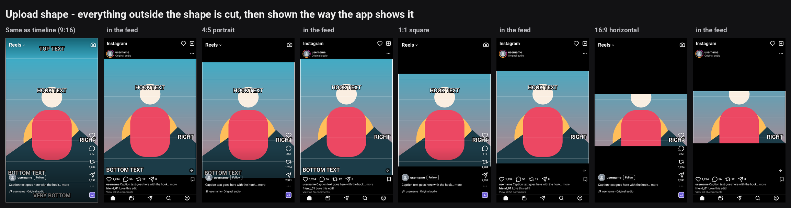

- **Vertical timeline:** the whole monitor is the phone.
- **Horizontal timeline:** the phone is drawn in the middle of the frame, on black.
- **Same as timeline:** nothing is cut (a 16:9 timeline shows up letterboxed on the phone, like a horizontal upload).

## Inspector

Three collapsible sections; every control has a hover tooltip.

| Section | Controls |
|---|---|
| 1 Start here | **Platform**, **View**, **App theme** (dark / light), **Timeline** (1080 × 1920, 2160 × 3840, 720 × 1280 vertical; 1920 × 1080, 3840 × 2160 horizontal), **Upload shape** (same as timeline, 9:16, 4:5, 1:1, 3:4, 16:9) |
| 2 Overlay look | **GUI opacity**, **Show safe-zone guides** (red = covered by the app, green dashed = safe box, yellow = feed 4:5 / grid 3:4 crop lines, cyan = where your video sits), **Guide opacity**, **Show GUI only** |
| 3 Your video inside the app | **Picture**: Like the app (default) / Fill the slot (crop) / Show whole video (fit); **Zoom**; **Reframe X / Y** to move the crop like choosing a cover crop |

"Like the app" means: full-screen and comments show the whole upload, full-width feed posts match the width and
crop the height, cards and thumbnails crop to fill.

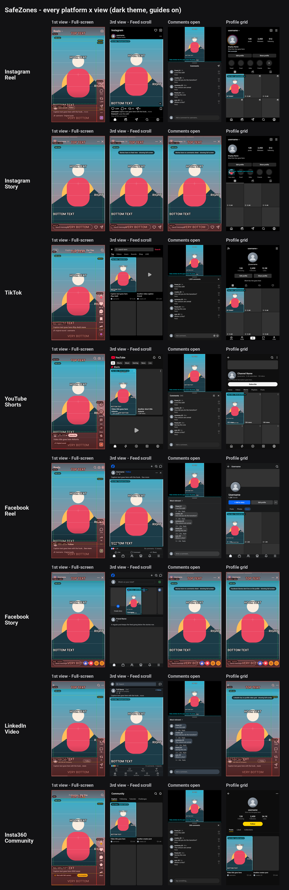

## How it works

```
MediaIn → SZCtrl → SZIn → SZCut ──→ SZResize → SZCanvas → SZPlace → SZVideo → SZGui → SZGuides → SZOutFit → SZOutPad → SZOut → MediaOut
          (maths)  (timeline) (upload   (whole upload      (into the  (over     (GUI     (guides    (phone into the timeline
                               shape)    inside the phone)  slot)      black)    Switch)  Switch)    frame, black around it)
```

- Every app screen is a transparent PNG drawn by `src/Giniroisenkou_SafeZones_gen.py` (Lucide icons, Roboto text, the
  apps' colours, rendered with resvg). Feed, comments and grid screens are opaque with a **hole** where the video shows,
  so the overlay itself masks the video.
- Two native **Switch** tools pick the GUI (Platform × View × Theme) and the guide layer. A Transform scales the upload
  into that screen's slot.
- `SZCtrl` is a pass-through node holding every control; all geometry is hidden expressions on it.

## Build it yourself

```
python src/Giniroisenkou_SafeZones_fetch_tools.py   # once: Lucide, Simple Icons, Roboto, resvg -> _tools/
python src/Giniroisenkou_SafeZones_build.py         # overlays, macros, thumbnails, docs, Giniroisenkou_SafeZones.drfx
```

Needs Python 3 with Pillow, and git. Positions live in the drawing functions and the `DANGER` / `CROPS` tables in
`src/Giniroisenkou_SafeZones_gen.py`: change one, run the build, get a new `.drfx`.

## Repository layout

```
Giniroisenkou_SafeZones.drfx                  the file to install (drag onto Resolve)
src/Giniroisenkou_SafeZones_gen.py            draws every app screen + guides, writes build/slots.json
src/Giniroisenkou_SafeZones_macro.py          writes the Fusion macros
src/Giniroisenkou_SafeZones_thumbs.py         Effects-panel thumbnails + per-app preview strips
src/Giniroisenkou_SafeZones_preview.py        test frame + contact sheets (mirrors the macro)
src/Giniroisenkou_SafeZones_build.py          runs everything and packs the .drfx
src/Giniroisenkou_SafeZones_fetch_tools.py    downloads the build tools
docs/                                         preview images
DESCRIPTION.txt                               short summary
THIRD_PARTY_NOTICES.md, licenses/             icon and font licences
```

## Things to know

- App layouts change often; these match the apps as of September 2026. **Insta360's community screens are an
  approximation** (no published spec). Edit the drawing functions when an app moves something.
- Phones are taller than 9:16. On tall phones some apps put the Story reply bar or the nav bar outside the video;
  the overlays assume the worst case (bar over the video).
- Text in the overlays is placeholder text; nothing personal is included. Platform marks only identify each app.
- The very first frame after switching to a new screen can occasionally draw half-way; moving the playhead fixes it.

## Version

**2026-09-26 (2)** — added LinkedIn Video and Insta360 Community; **Upload shape** replaces
Footage shape: the timeline is cut to the upload shape (never squeezed) and shown as the app shows it; horizontal
timelines supported (phone centred on black); per-view "like the app" fit rules.
**2026-09-26 (1)** — rebuild: phone-screen model, 6 apps × 4 views × dark / light, guides, quick effects with icons.

Built and tested on DaVinci Resolve Studio 21.1 (Windows).

## License

MIT (code). Icons and font: see `THIRD_PARTY_NOTICES.md`.
