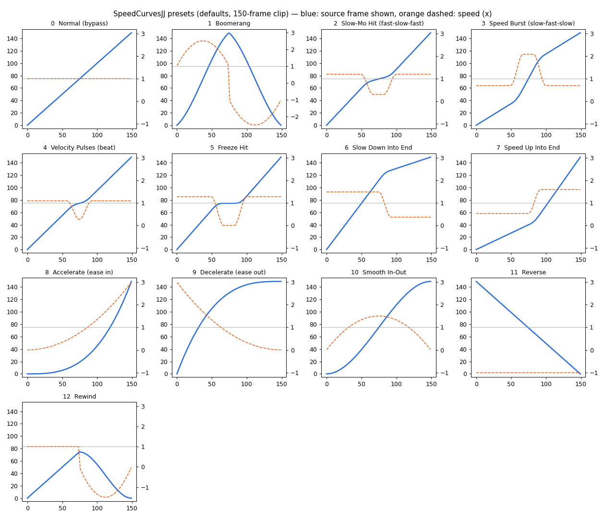

# Speed_Curves

A DaVinci Resolve **Edit-page effect** (Fusion macro) that retimes a clip with ready-made
**speed curves**: boomerang, slow-mo hit, speed burst, velocity pulses, freeze hit, rewind and
more, with no Retime Curve keyframes to draw. Drop it on a clip, pick a preset, move the Hit Point.


## Install

1. Download `Giniroisenkou_Speed_Curves.drfx` from this folder.
2. **Drag it onto the Resolve window** and confirm, then restart Resolve.
   (Copying the `.setting` into the Templates folder by hand does **not** work: the
   effect shows up by name with no controls.)
3. Find it in **Effects → Speed_Curves** on the Edit page.

You get the main effect **Speed_Curves** (every preset in a dropdown) plus one quick effect
per preset, each with its own thumbnail: `Speed_Curves_Boomerang`, `Speed_Curves_SlowMoHit`,
`Speed_Curves_SpeedBurst`, `Speed_Curves_VelocityPulses`, `Speed_Curves_FreezeHit`,
`Speed_Curves_SlowDownEnd`, `Speed_Curves_SpeedUpEnd`, `Speed_Curves_Accelerate`,
`Speed_Curves_Decelerate`, `Speed_Curves_SmoothInOut`, `Speed_Curves_Reverse`, `Speed_Curves_Rewind`.

## Use

Drop the effect **on the clip itself**, not on an adjustment clip: an adjustment clip only
sees the current frame of what is under it, so there is nothing to retime.

### Reading the icons

- **Line** = which frame of the footage is shown over the clip's length (like Resolve's
  Retime Curve). Dashed diagonal = normal speed.
- **Colour strip** = speed: **blue** slow-mo · **white** ~1x · **orange** fast ·
  **grey** frozen · **magenta** backwards.
- **Yellow marker** = Hit Point.

In the Preset dropdown each name is followed by a small text speed graph, e.g.
`Slow-Mo Hit ▄▄▄▄▃▁▁▃▄▄▄▄` (tall = fast, low = slow, `·` = frozen, `◂` = backwards).

## Presets

| # | Preset | What it does |
|---|---|---|
| 0 | Normal | untouched, 1x |
| 1 | Boomerang | forward then backward; **Cycles** = how many back-and-forths |
| 2 | Slow-Mo Hit | fast in, slow-mo on the Hit Point, fast out (classic velocity ramp) |
| 3 | Speed Burst | slow, whips to **Fast Speed** around the Hit Point, slow again |
| 4 | Velocity Pulses | several slow-mo hits spread evenly; set **Cycles / Beats** to the beat |
| 5 | Freeze Hit | ramps into a freeze frame at the Hit Point, holds, ramps out |
| 6 | Slow Down Into End | normal, then eases into slow-mo from the Hit Point |
| 7 | Speed Up Into End | normal, then accelerates to Fast Speed from the Hit Point |
| 8 | Accelerate | starts slow, ends fast |
| 9 | Decelerate | starts fast, ends slow |
| 10 | Smooth In-Out | eases in and out, fastest in the middle |
| 11 | Reverse | plays backwards |
| 12 | Rewind | plays forward to the Hit Point, then rewinds to the start |



## Inspector

| Control | Meaning |
|---|---|
| Preset | the curve |
| Intensity (mix) | 0 = normal speed, 1 = full preset |
| Hit Point | where the key moment sits (0 = start, 1 = end of the clip) |
| Ramp Width | how gradual the ramps are |
| Hold Length | length of the slow / frozen part around the Hit Point |
| Slow Speed | speed of the slow part (0.25 = 25 %) |
| Fast Speed | speed of bursts; also the strength of Accelerate / Decelerate |
| Cycles / Beats | boomerang back-and-forths, number of velocity pulses |
| Boomerang Ease | 0 = hard bounce, 1 = soft bounce |
| Fit Whole Clip | **on**: the whole footage still plays within the clip, so the other parts speed up to make room for the slow-mo. **off**: real speeds (1x stays 1x; slow-mo uses less footage, bursts may reach the end and hold the last frame) |
| Source In / Out | use only part of the footage (0 – 1) |
| Length Override | force the clip length in frames if auto-detection is wrong (0 = auto) |
| Show Speed HUD | shows the live speed and source frame on screen, for checking |
| Frame Blend / Blend Spread | frame blending for smoother slow-mo |

## How it works

```
MediaIn → SCCtrl → SCTime → SCMerge → MediaOut
          (controls) (TimeStretcher)  ↑ optional SCHud (Text+ speed readout)
```

- `SCCtrl` is a pass-through node holding every control.
- `SCTime` is a TimeStretcher whose **Source Time** is a Lua expression: it maps the position
  in the clip (0 – 1, from the comp's render range) through the chosen curve to a source frame.
  No keyframes, so presets and sliders can be changed freely.

## Build it yourself

```
python src/Giniroisenkou_Speed_Curves_gen.py
lua    src/Giniroisenkou_Speed_Curves_test.lua
```

The generator writes the macros to `build/`, draws a thumbnail beside every `.setting`,
redraws `docs/Giniroisenkou_Speed_Curves_cheatsheet.png` and packs
`Giniroisenkou_Speed_Curves.drfx`. Needs Python 3 with Pillow. The test loads a `.setting`
the way Fusion does and evaluates every preset (source frame always inside the clip).
**To add a preset**, add it to `PRESETS` and `SHORT`, and add its branch to `CURVE_LUA`
and to the Python twin `curve()` (used for the icons).
Set `SPARKLINES = False` if the dropdown graphs show as boxes.

`src/Giniroisenkou_Speed_Curves_testclip.lua` (run in Resolve's Lua console) appends a random
Media Pool clip at the end of the timeline, gives it an unused clip colour and wires the
macro into a Fusion comp on it, without touching existing clips.

## Repository layout

```
Giniroisenkou_Speed_Curves.drfx             the file to install (drag onto Resolve)
src/Giniroisenkou_Speed_Curves_gen.py       generator (presets, curve maths, controls, icons, package)
src/Giniroisenkou_Speed_Curves_test.lua     offline check of the macro maths
src/Giniroisenkou_Speed_Curves_testclip.lua in-Resolve test helper
docs/                                      preview images
DESCRIPTION.txt                            short summary
```

## Things to know

- Works on the clip, not on an adjustment clip.
- The Hit Point follows the clip's length on the timeline; if it feels off, set Length Override.
- Slow-mo below ~0.25x from normal-frame-rate footage will look steppy; Frame Blend smooths it.

## Version

**2026-09-26**: moved into the collection layout; effects renamed
`Speed_Curves` / `Speed_Curves_<Preset>`.
**2026-09-25**: first version, 13 presets, icon per preset, one quick effect per preset,
text speed graph in the dropdown.

Built for DaVinci Resolve Studio 21.1 (Windows). Checked offline; first in-Resolve test pending.

## License

MIT
