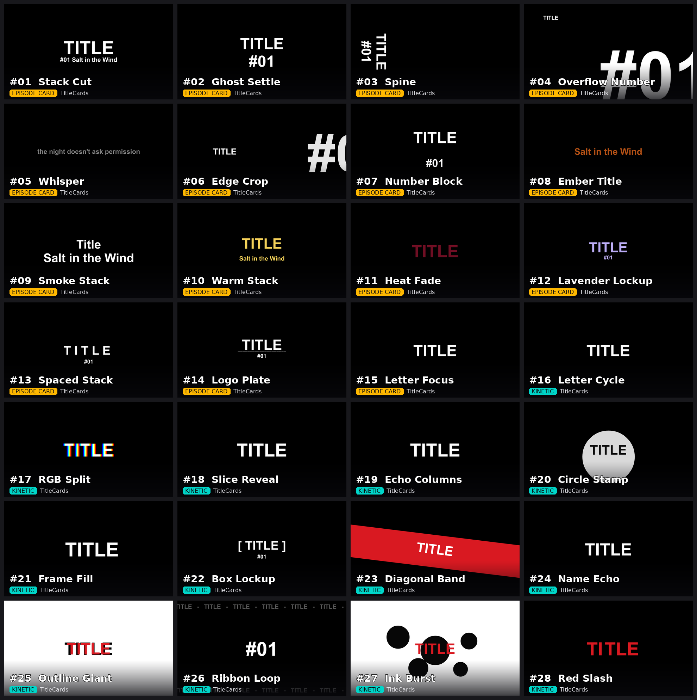

# TitleCards

28 drop-on-a-clip title-card generators for DaVinci Resolve's Edit page, styled after the
kind of kinetic-type episode cards and loading-screen title reveals you see in anime openings
and story-driven games — a word, a number/tag, sometimes a subtitle line, animated on and back
off. Every type has its own preview thumbnail in the Effects panel. Nothing here reproduces any specific show's logo, character art or wordmark: every default
is a generic placeholder ("Title", "#", "01") and every look is built from plain Fusion text,
transform, blur and colour-gain nodes, not a copy of anyone's actual assets.



## Install

Drag `Giniroisenkou_TitleCards.drfx` onto the Resolve window, confirm, then restart Resolve.
The effects appear on the Edit page under **Effects ▸ TitleCards** (all named `TitleCards_…`).
Drop one on a clip and set it up in **Inspector ▸ Effects**. Hover a control to read what it does.

Copying the `.setting` files into the Templates folder by hand does **not** work: the effect
shows up by name with no controls.

## Shared controls (every type)

| Control | What it does |
|---|---|
| Word | Main title word or short phrase |
| Number Prefix | Shown before the Tag, e.g. `#`. Leave blank for none |
| Tag | Episode number **or any short word/phrase** — not limited to numbers, exactly as requested: "I might use the way the text is but not the number, could be another word, but keep a prefix for numbers too" |
| Subtitle | Smaller line(s) under the title. It's a multi-line box — press Enter for your own line breaks |
| Quote Line | Optional caption/quote line, also multi-line |
| In Length (fr) | How long the title takes to appear, counted from the start of the clip |
| Out Point | **At clip end (auto)** (default): the title stays until the clip ends and fades out over the last Out Length frames — trim the clip to set how long the title is on screen. **After Hold frames**: leaves after the Hold frames instead |
| Hold (fr) | Only used when Out Point = After Hold |
| Out Length (fr) | How long the title takes to disappear |
| Background | Over Clip (transparent), Black Card, or White Card — draws over your footage or replaces it |
| Colour | White, Gold, Red, Orange, Lavender or Custom (with its own R/G/B sliders) |
| Nudge Scale / X / Y | Fine-tune size and position without touching the layout |

A type that doesn't use one of the text fields simply ignores it (e.g. a type built around the
Quote Line won't show the Tag, but the field is still there to type into).

## The 28 types

**Episode Card** (closer to a classic anime episode title card):

| # | Type | Feel |
|---|---|---|
| 1 | Stack Cut | Hard, no-fade cut on and off — word over prefix+tag and a short line |
| 2 | Ghost Settle | Drifts into focus from a heavy blur, then settles sharp |
| 3 | Spine | Vertical text along the left edge, drops in from above, exits below |
| 4 | Overflow Number | Tiny word top-left, the tag blown up huge bottom-right, spilling off frame |
| 5 | Whisper | One quiet line (Quote Line), barely breathing, no hard motion |
| 6 | Edge Crop | Giant tag pushed off the right edge, the word slides in from the left |
| 7 | Number Block | Word drops from above, tag rises from below, meeting in the middle |
| 8 | Ember Title | A single line that flickers like a dying ember while it holds |
| 9 | Smoke Stack | Grey smoke-blur clears into colour as the stack settles |
| 10 | Warm Stack | Word settles first, the subtitle line catches up half a beat later |
| 11 | Heat Fade | Warm and bright while held, cools toward dark as it exits |
| 12 | Lavender Lockup | Clean centred word-over-tag lockup with a soft pop-in |
| 13 | Spaced Stack | Letters pushed apart for a wide, spaced-out headline |
| 14 | Logo Plate | Word-and-tag lockup with a thin accent line that pops in beneath it |

**Kinetic** (closer to a loading-screen / kinetic-type reveal):

| # | Type | Feel |
|---|---|---|
| 15 | Letter Focus | Opens zoomed in tight on the start of the word, pulls back to reveal it all |
| 16 | Letter Cycle | Flips through the word's letters one at a time, then locks onto the whole word |
| 17 | RGB Split | Red/blue channels start split apart and snap together as the title lands |
| 18 | Slice Reveal | Overlapping copies of the word slide in from alternating sides before the last one locks |
| 19 | Echo Columns | Fast scrolling repeats of the word race by before the real title slams into place |
| 20 | Circle Stamp | A filled dot pops in behind the word like a wax stamp |
| 21 | Frame Fill | The word starts huge, filling the frame, then eases back to a normal title size |
| 22 | Box Lockup | The word sits inside a bracketed lockup, tag stacked underneath |
| 23 | Diagonal Band | A tilted band of colour slides in carrying the title, then slides back out |
| 24 | Name Echo | The title leaves a soft trail of fading ghost copies as it settles |
| 25 | Outline Giant | A larger dark silhouette sits just behind the coloured word for a bold stroked look |
| 26 | Ribbon Loop | Two thin ribbons of scrolling text loop continuously behind the tag while it holds |
| 27 | Ink Burst | Small ink-blot shapes pop in and scatter into place, then the word lands on top |
| 28 | Red Slash | The word splits into two halves that slide together from opposite sides, crossed by a flash |

## How it works

Every type is a Fusion macro with one pass-through **Ctrl** node (`BrightnessContrast`) that
carries every Inspector control plus the hidden maths as expressions (all control ids start
with `k`). Content is built from `TextPlus`, `Transform`, `Blur` and `ColorGain` —
standard tools only, reading the Ctrl node through `time`-based expressions. A shared "finish"
chain (nudge → background plate → composite over the clip) is identical across all 28 types.

Things learned (and fixed) while building this pack, worth knowing if you extend it:
- **Text+ colour is not premultiplied.** Fading only `Alpha1` leaves the colour on screen as an
  additive glow, so the title never really disappears. Every text layer here multiplies its colour
  by the same alpha it fades with.
- **Fusion's Y axis points up** (0 = bottom). The generator writes layouts top-down and flips them in
  one place (`PT()`), so "subtitle under the title" and "drops from above" come out the right way.
- **Time-offset nodes (`TimeSpeed`) don't work on generated text inside a clip effect** — Name Echo
  rendered nothing (and once took Resolve down). Its trail is now built from staggered copies.
- **A clip effect runs at the clip's own resolution** (a 4K clip = a 4K comp, even on a 1080x1920
  timeline), and its `time` starts at 0 on the clip's first frame. `comp.RenderEnd` gives the clip end,
  which is what the auto Out Point uses. Text layers with very long repeated strings are the slowest
  part, so Diagonal Band's band uses fewer glyphs.
- Words drawn on a shape of the title colour (Circle Stamp, Diagonal Band) switch to a contrasting
  colour automatically; Ink Burst uses black ink blots under the coloured word.
- Fusion's `Crop` tool works in **pixels**, not a 0–1 fraction of the frame — a `Crop` set up
  with fractional offsets/sizes silently does nothing useful. Several types (Slice Reveal,
  Diagonal Band, Red Slash, Logo Plate) were redesigned around `TextPlus`/`Transform`/`ColorGain`
  instead, once this was confirmed against a live Resolve session.
- `string.gsub` needs an explicit capture group — `"."` + `"%1 "` does nothing useful;
  `"(.)"` + `"%1 "` does (used by Spaced Stack). Lua also returns two values from `gsub`
  (string, count); wrapping the call in an extra pair of parens keeps only the string when it's
  concatenated inline.
- Fusion has no live per-glyph text metrics in expressions, so a few of the original animated
  mockups (precise per-letter positions, true masked wipes) are approximated here with
  whole-string transforms, `string.sub` character slicing, or layered/staggered copies instead
  of pixel-exact ports — close in spirit, not a 1:1 recreation of the mockup.
- Every animated field was verified by loading the actual `.setting` in Resolve
  (`fusion.LoadComp`) and reading back its evaluated value frame-by-frame, not just by eyeballing
  the generator source.

## Build

```
python src/Giniroisenkou_TitleCards_gen.py              # writes build/Edit/Effects/TitleCards/*.setting
#   render each type in Resolve (Black Card background), export stills as renders/r_<Type>.png
python src/Giniroisenkou_TitleCards_thumbs.py renders/  # Effects-panel thumbnails + docs/
python src/Giniroisenkou_TitleCards_package.py          # -> Giniroisenkou_TitleCards.drfx
```

Needs Python 3 with Pillow (thumbnails only). To add a type: write a `_name()` function in the generator
(controls + content nodes, reusing the `ttext`/`head_meta`/`finish_nodes` helpers) and append it
to `EFFECTS`.

## Repository layout

```
Giniroisenkou_TitleCards.drfx               the file to install (28 effects + thumbnails)
src/Giniroisenkou_TitleCards_gen.py         macro generator: every type, control and expression
src/Giniroisenkou_TitleCards_thumbs.py      Effects-panel thumbnails + contact sheet
src/Giniroisenkou_TitleCards_package.py     packs the .drfx
docs/                                       preview images (rendered in Resolve on the Black Card)
DESCRIPTION.txt                             short summary
```

## Version

**2026-09-27 (fix)** — titles no longer vanish for good after ~3 seconds: the out point now
follows the end of the clip (new *Out Point* control). Fades now really fade (they used to leave a
glowing copy on screen). Vertical layouts were upside down; fixed. Name Echo rebuilt (it rendered
nothing). Circle Stamp and Outline Giant drew nothing (a node was missing from their graph); fixed.
Spine no longer rotates off the top of the frame. Words on same-coloured shapes now contrast.
Added a thumbnail for every type. All 28 re-rendered and checked in Resolve 21.1 on a real clip.

**2026-09-27** — first build. All 28 types generated, loaded in a live Resolve 21.1 session via
`fusion.LoadComp`, and spot-checked frame-by-frame against their intended animation curves.

## Credits

No third-party assets. Default text is generic placeholder text only.

## License

MIT
