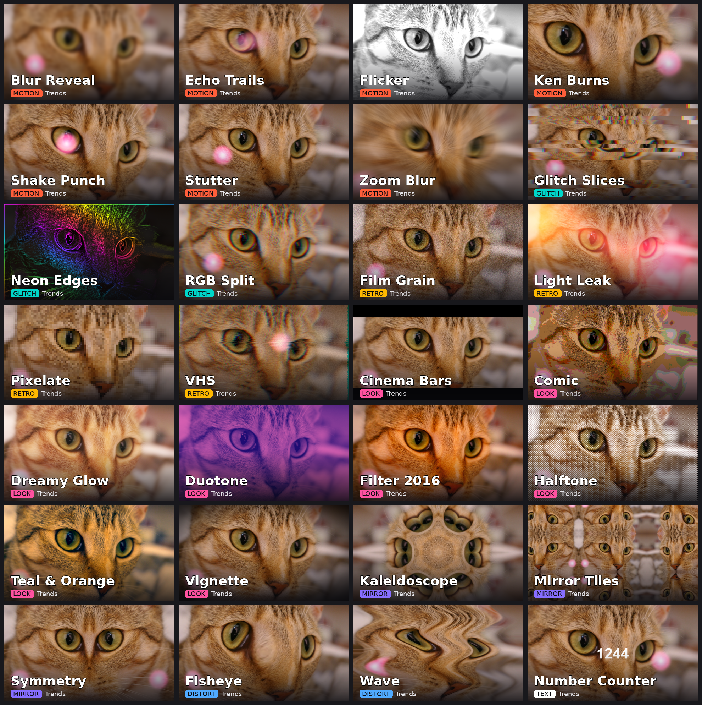

# Trends

28 drop-on-a-clip effects for the looks that trend on Instagram Reels, TikTok and Shorts:
trails, glitches, retro tape, film grain, colour looks, mirrors, distortions and a number counter.
Every effect has its own thumbnail in Resolve's Effects panel and a short description on each control.



## Install
Drag `Giniroisenkou_Trends.drfx` onto the Resolve window, confirm, then restart Resolve.
The effects appear on the Edit page under **Effects ▸ Trends** (all named `Trends_…`).
Drop one on a clip (or on an Adjustment Clip to affect everything under it) and set it up in
**Inspector ▸ Effects**. Hover a control to read what it does.

Copying the `.setting` files into the Templates folder by hand does **not** work: the effect shows up
by name with no controls.

## The effects

| Effect | What it does | Main controls |
|---|---|---|
| **Motion** | | |
| Echo Trails | Delayed ghost copies of the clip: motion trails, optional rainbow tint, past or future echoes | Echoes, Spacing, Strength, Decay, Rainbow Tint, Trail From |
| Stutter | Choppy frame-hold (low fps), stutter loop, or back-and-forth wobble | Style, Hold / Chunk Length, Loop Repeats |
| Shake Punch | Handheld shake + zoom punch on a beat | Shake, Speed, Rotation, Base Zoom, Punch, Beat Every, Decay, Offset |
| Zoom Blur | Radial speed streaks from a centre point, optional beat pulse | Amount, Centre X/Y, Pulse Every / Length / Offset, Mix |
| Ken Burns | Slow cinematic zoom + pan with easing | Zoom Start / End, Pan X/Y, Rotation, Start Frame, Duration, Easing |
| Blur Reveal | Focus-in / focus-out blur transition or beat blur pulse, with a little zoom | Mode, Max Blur, Zoom With Blur, Start, Duration, Pulse |
| Flicker | Strobe: the clip switches off every few frames (the track below shows through) | Flicker Every, Phase, Off-Frame Opacity / B&W / Brightness |
| **Glitch** | | |
| RGB Split | Red and blue channels pulled apart, with beat-held jitter | Amount, Angle, Jitter, Hold, Seed, Mix |
| Glitch Slices | Horizontal strips jump sideways with RGB tearing | Slices, Shift, Glitchiness, RGB Tear, Change Every, Seed, Pulse, Mix |
| Neon Edges | Outlines turned into glowing rainbow neon over a dark frame | Edge Strength, Line Width, Background Video, Glow Boost, Colour Offset / Cycle |
| **Retro** | | |
| VHS | 90s tape: colour bleed, line jitter, scanlines, noise, rolling tracking band | Colour Shift, Jitter, Scanlines, Noise, Washed Colour, Tracking Band |
| Film Grain | Moving grain (strongest in mid-tones) + exposure flicker | Amount, Grain Size, Colour Grain, Exposure Flicker |
| Pixelate | Mosaic blocks, static or animated in / out | Block Size, Animate, Start, Duration, Mix |
| Light Leak | Drifting film light leaks, 5 palettes | Colours, Intensity, Size, Drift Speed, Phase |
| **Look** | | |
| Filter 2016 | Old-Instagram look: saturation, warmth, faded blacks, glow, vignette | Saturation, Contrast, Warmth, Faded Blacks, Glow, Vignette |
| Dreamy Glow | Soft bloom with haze and warm tint | Glow, Size, Threshold, Haze, Warmth, Soften Colours, Mix |
| Teal & Orange | Blockbuster grade: teal shadows, orange skin and highlights | Amount, Saturation, Contrast |
| Duotone | Two-colour poster look, 8 colour pairs | Colours, Swap, Contrast, Mix |
| Comic | Cartoon: flat posterized colour + ink outlines | Colour Levels, Ink Lines, Line Width, Saturation, Mix |
| Halftone | Print dots: newspaper, colour dots or pop-art pink | Style, Dot Spacing, Dot Size, Screen Angle, Mix |
| Vignette | Dark or white vignette with size, softness and centre | Amount, Size, Softness, Roundness, Colour, Centre X/Y |
| Cinema Bars | Letterbox / pillar bars to any aspect (2.39:1 … 9:16), slide in or out | Aspect, Animate, Start, Duration, Bar Colour, Opacity |
| **Mirror** | | |
| Mirror Tiles | Mirrored tiling with scroll and spin | Tiles Across, Scroll X/Y, Rotation, Spin |
| Kaleidoscope | Mirrored slices around a centre, spinning | Segments, Rotation, Spin, Zoom, Centre X/Y, Mix |
| Symmetry | One half mirrored onto the other (left, right, top, bottom, 4-way) | Mirror, fold positions, Mix |
| **Distort** | | |
| Wave | Horizontal / vertical wobble or water ripple | Style, Strength, Waves, Speed, Ripple Centre, Mix |
| Fisheye | Bulge (or pinch) lens, optional beat pulse | Amount, Radius, Centre X/Y, Pulse, Mix |
| **Text** | | |
| Number Counter | Count From → To with ease-out, mm:ss.cc timer, or frame number, with prefix / suffix | Mode, From, To, Start, Duration, Decimals, Prefix, Suffix, Font, Size, Position, Colour |

**Beat pulse:** Zoom Blur, Glitch Slices, Blur Reveal and Fisheye have *Pulse Every (frames)*. At 30 fps,
15 = 120 BPM, 20 = 90 BPM; use *Beat Offset* to land it on the hit.

**Resolution:** every effect returns the same size as its input and works on normalized
coordinates, so 4K / 16:9 footage on a 9:16 timeline is fine. Size controls say "px at 1080" and
scale with the frame. Cinema Bars follows the frame it sits on, so use it on an Adjustment Clip for the timeline shape.

## How it works
Each effect is a Fusion macro with one pass-through **Ctrl** node that holds every Inspector control
(ids start with `k` so they never clash with the node's own inputs) and all hidden maths as expressions.
The work is done by standard tools (TimeSpeed, TimeStretcher, Transform, Merge, SoftGlow, Blur, Text+)
or by one **CustomTool** doing per-pixel maths on the effect's own input.

Things learned on Resolve 21.1 while building this pack:
- CustomTool `sin` / `cos` / `atan2` work in **degrees** (Ctrl-side expressions use radians).
- CustomTool has no `exp` / `pow`; comparisons are avoided (selectors are `max(0,1-abs(a-b))`).
- `get??b()` samplers return black at the frame edge, so sample coordinates are kept 1.5 px inside.
- No Background / Mask nodes sized by "frame format": a clip's effect runs at the clip's own resolution.
- Effects-panel thumbnails stay blank when the PNG is bigger than ~48 KB, so they are saved as 256-colour PNGs.

## Build
```
python src/Giniroisenkou_Trends_gen.py         # writes build/Edit/Effects/Trends/*.setting
python src/Giniroisenkou_Trends_sampleclip.py  # neutral test clip (CC0 cat photo + moving light)
#   render each effect on that clip in Resolve, export stills as renders/r_<Effect>.png
python src/Giniroisenkou_Trends_thumbs.py renders/  # Effects-panel thumbnails + docs/
python src/Giniroisenkou_Trends_package.py     # -> Giniroisenkou_Trends.drfx
```
Needs Python 3 with Pillow (numpy, scikit-image and ffmpeg for the sample clip).
To add an effect: write a `_name()` function in the generator (controls + nodes) and append it to `EFFECTS`.

## Repository layout
```
Giniroisenkou_Trends.drfx                 the file to install (28 effects + thumbnails)
src/Giniroisenkou_Trends_gen.py           macro generator: every effect, control, tooltip and expression
src/Giniroisenkou_Trends_thumbs.py        Effects-panel thumbnails + contact sheet
src/Giniroisenkou_Trends_sampleclip.py    neutral preview clip
src/Giniroisenkou_Trends_package.py       packs the .drfx
docs/                                     preview images (rendered in Resolve on the sample clip)
DESCRIPTION.txt                           short summary
```

## Version
**2026-09-27** — rebuilt the original 8-effect pack (8 effects, loose `.setting` install that showed
effects by name only) as a drag-install `.drfx` with thumbnails and control descriptions; regenerable
source (the original generator was lost). Flicker and Filter 2016 rebuilt without frame-format-sized
nodes (they could break on clips whose resolution differs from the timeline). Control ids renamed so
Filter 2016's Contrast no longer doubles up with the node's own contrast. Added 20 new effects:
Zoom Blur, Ken Burns, Blur Reveal, Glitch Slices, Neon Edges, VHS, Film Grain, Pixelate, Light Leak,
Dreamy Glow, Teal & Orange, Duotone, Comic, Halftone, Vignette, Cinema Bars, Kaleidoscope, Symmetry,
Wave, Fisheye. Tested in Resolve Studio 21.1 on a 4K clip and on the 720p sample clip.

## Credits
Preview images use the "chelsea" cat photo from scikit-image (CC0). Thumbnail font: DejaVu Sans.

## License
MIT
